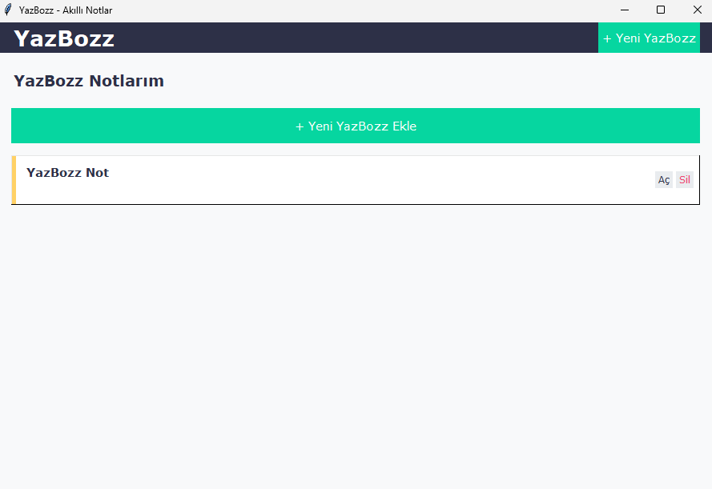

# 📝 YazBozz - Akıllı Not Uygulaması

## 🖼️ Ekran Görüntüleri

<div align="center">
  
  
</div>

Python ile geliştirilmiş modern ve kullanıcı dostu dijital not defteri uygulaması. Günlük görevleriniz, fikirleriniz ve önemli notlarınız için mükemmel çözüm.

## ✨ Öne Çıkan Özellikler

| Özellik | Açıklama |
|---------|----------|
| 🎨 Renk Kişiselleştirme | Her not için özel renk seçeneği |
| 📌 Çoklu Not Desteği | Aynı anda birden fazla not yönetimi |
| 🔄 Otomatik Kayıt | Verileriniz otomatik olarak kaydedilir |
| 🖱️ Sürükle-Bırak | Notları kolayca taşıyabilme |
| 🔎 Hızlı Arama | Notlarınızda anında arama yapabilme |

## 🚀 Hızlı Başlangıç

```bash
# Projeyi klonlayın
git clone https://github.com/lucsoubeyras/YazBozz.git

# Proje dizinine girin
cd YazBozz

# Gerekli bağımlılıkları yükleyin
pip install -r requirements.txt

# Uygulamayı başlatın
python sticky.py